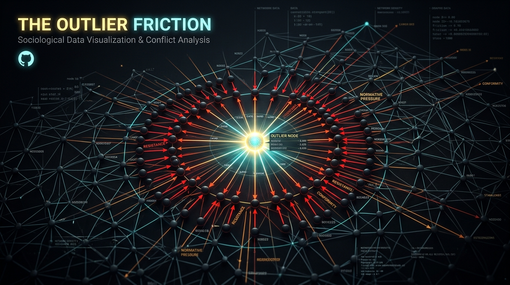
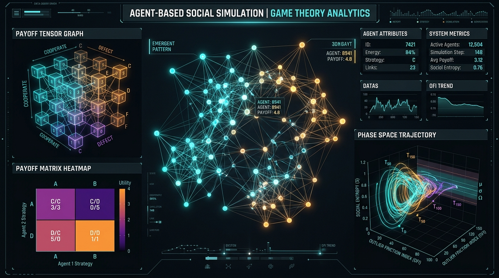

<div align="center">
  
</div>

# The Outlier Friction: Mikro-Topluluklarda Vasatlık Konsensüsü, Uç Değer Tasfiyesi ve Yatay Şiddetin Anatomisi

[](LICENSE)
[](https://www.python.org/)
[](outlier_friction/)
[](index.html)
[](README_EN.md)

> *"Topluluklar sınırlarını kanun metinleriyle değil, kurban ettikleri sapkınlarla çizer. Aykırı birey, topluluğun sınır nöbetçisidir; cezalandırıldığı ve tecrit edildiği an, grubun vasatlık normları ve asgari efor sözleşmesi yeniden kutsanır."*

---

## İçindekiler
1. [Prolegomena: Kapalı Havza Sendromu ve Sosyal Entropi](#1-prolegomena-kapalı-havza-sendromu-ve-sosyal-entropi)
2. [Sosyolojik Altyapı: Sınır Bekçiliği, Kurban ve Yatay Panoptikon](#2-sosyolojik-altyapı-sınır-bekçiliği-kurban-ve-yatay-panoptikon)
3. [Sosyal Psikolojik İnfaz: Kara Koyun Dinamiği ve Bilişsel Çelişki](#3-sosyal-psikolojik-infaz-kara-koyun-dinamiği-ve-bilişsel-çelişki)
4. [Evrimsel Antropoloji: Ters Hiyerarşi ve Eşitlikçilik Yanılsaması](#4-evrimsel-antropoloji-ters-hiyerarşi-ve-eşitlikçilik-yanılsaması)
5. [Felsefi Derinlik: Hınç Ahlakı (Ressentiment) ve Düzleştirme](#5-felsefi-derinlik-hınç-ahlakı-ressentiment-ve-düzleştirme)
6. [İletişimsel İmha Protokolü: Stanley Schachter Modeli](#6-iletişimsel-imha-protokolü-stanley-schachter-modeli)
7. [Sessiz Şiddetin Biyolojisi: Ostracism ve Nörolojik İmha (fMRI / dACC)](#7-sessiz-şiddetin-biyolojisi-ostracism-ve-nörolojik-imha-fmri--dacc)
8. [Eşitler Arası Asimetri: Yatay Şiddet ve Kolektif Gazlama (Mob-Gaslighting)](#8-eşitler-arası-asimetri-yatay-şiddet-ve-kolektif-gazlama-mob-gaslighting)
9. [Sürtünmenin 5 Fazlı Algoritmik Matrisi ve Vaka İncelemeleri](#9-sürtünmenin-5-fazlı-algoritmik-matrisi-ve-vaka-incelemeleri)
10. [Matematiksel Modelleme, Ağ Teorisi ve Oyun Kuramı](#10-matematiksel-modelleme-ağ-teorisi-ve-oyun-kuramı)
11. [Outlier Friction Index (OFI) Teşhis Çerçevesi](#11-outlier-friction-index-ofi-teşhis-çerçevesi)
12. [Outlier Doktrini: Stratejik Asimetri ve Kurtuluş Protokolü](#12-outlier-doktrini-stratejik-asimetri-ve-kurtuluş-protokolü)
13. [Python Simülasyon Kütüphanesi & CLI Kullanımı](#13-python-simülasyon-kütüphanesi--cli-kullanımı)
14. [İnteraktif Web Platformu & Simülatör](#14-interaktif-web-platformu--simülatör)
15. [Kaynakça](#kaynakça)

---

## 1. Prolegomena: Kapalı Havza Sendromu ve Sosyal Entropi

Üniversite amfileri, enstitü laboratuvarları, staj ekipleri veya kurumsal departman koridorları açık birer serbest pazar değildir. Bu yapılar; üyelerinin günün büyük bölümünü aynı fiziksel ve sosyal sınırda geçirdiği, kaçış rotalarının kısa vadede kısıtlı olduğu, coğrafi ve hiyerarşik sınırları tahkim edilmiş **yüksek sürtünmeli mikro-havzalardır**.

Termodinamiğin İkinci Yasası kapalı sistemlerde entropinin maksimuma (düzensizliğin ve homojenliğin en kararlı alt enerji düzeyine) evrildiğini söyler. Benzer şekilde, kapalı bir mikro-havzada sosyal entropi; **asgari çaba, ortak vasatlık ve kolektif durağanlık** noktasında dengelenir.

```
       [KAPALI MİKRO-HAVZA]
┌───────────────────────────────────────────────────────────┐
│                                                           │
│    Peer A (Vasat) ◄──────► Peer B (Vasat)                 │
│          ▲                        ▲                       │
│          │   [Zımni Sözleşme:     │                       │
│          │    Asgari Efor &       │                       │
│          │    Ortalama Konfor]    │                       │
│          ▼                        ▼                       │
│    Peer C (Vasat) ◄──────► Peer D (Vasat)                 │
│                                                           │
│                     ▲ (Yatay Baskı / Dışlama)             │
│                     │                                     │
│            ┌────────┴────────┐                            │
│            │  OUTLIER (Uç)   │ ──► [Ayna Etkisi:          │
│            │  (Yüksek Çaba / │      Vasatın Tembelliğini  │
│            │   Derin Üretim) │      Görünür Kılar]        │
│            └─────────────────┘                            │
└───────────────────────────────────────────────────────────┘
```

Böyle ortamlarda liyakat, entelektüel derinlik veya teknik yetkinlik her zaman kurucu değer işlevi görmez. Çoğu zaman belirleyici olan, grubun zımni (*tacit*) olarak mutabık kaldığı **"ortalama konfor seviyesi"**dir.

Bu havzada yerleşik vasatlık sözleşmesine imza atmayan—çalışma temposu, dili, ritmi, hırsı veya ilgisizliğiyle ortalamanın dışına taşan—birey, istatistiksel ve sosyolojik tanımıyla bir **"outlier"** (uç değer / sapan öğe) haline gelir.

> *"Outlier'ın varlığı nötr bir olgu olarak kalamaz. O, grubun kendi tembelliğini, yetersizliğini ve durağanlığını görünür kılan canlı bir ayna işlevi görür. Ayna kırılmak istenmez; aynayı tutan tasfiye edilir."*

René Girard'ın mimetik teori çözümlemesinde vurguladığı üzere, grubun kendi iç rekabet ve yetersizlik kaygıları tırmandığında, bu gerilim tek bir ortak hedefe yöneltilir:

> *"Topluluk içi rekabet ve kaos tehdidi belirdiğinde, grup kendi birliğini ancak ortaklaşa seçtiği tek bir günah keçisine (scapegoat) yönelerek ve onu kurban ederek yeniden tesis edebilir. Kurbanın tasfiyesi, topluluğa sahte bir arınma ve barış hissi hediye eder."*  
> — **René Girard**, *Le Bouc émissaire* (1982)

---

## 2. Sosyolojik Altyapı: Sınır Bekçiliği, Kurban ve Yatay Panoptikon

<div align="center">
  
  <p><em>Şekil 1: René Girard'ın Mimetik Kurban Mekanizması ve Mikro-Topluluklarda Odaklanan Akran Baskısı</em></p>
</div>

Topluluklar sınırlarını kanun maddeleriyle değil, cezalandırdıkları kurbanlarla çizer. Sosyolojik açıdan sapkınlık (*deviance*), grubun kendi ahlakını ve aidiyetini tescil ettiği kurucu bir ritüeldir.

> *"Sapkınlık olmasaydı, toplumun ahlaki bilinci körelirdi. Bir eylemin kınanması, grubun neyi doğru kabul ettiğini hatırlamasını sağlar. Suç ve norm ihlali, kolektif bilincin canlı tutulması, sınırların yeniden çizilmesi ve grup bütünlüğünün korunması için zorunlu bir toplumsal işlevdir."*  
> — **Émile Durkheim**, *Les Règles de la méthode sociologique* (1895)

Durkheim'ın tespitini mikro-sosyolojiye uyarlayan Kai Erikson, grubun aykırı unsura duyduğu yapısal gereksinimi deşifre eder:

> *"Bir topluluk, üyelerine nereye kadar gidebileceklerini ve sınırın nerede bittiğini ancak o sınırı ihlal edenleri cezalandırarak gösterebilir. Sapan kişi, topluluğun sınır nöbetçisidir; cezalandırıldığı an, grubun sınırları yeniden tescillenmiş olur."*  
> — **Kai T. Erikson**, *Wayward Puritans: A Study in the Sociology of Deviance* (1966)

Michel Foucault'nun disipliner iktidar kavramsallaştırması burada dikeyden yataya evrilir:

> *"Gözetim yalnızca yukarıdan aşağıya işlemez. Disiplin altına alınmış alanlarda bireyler birbirlerinin daimi gözetmeni ve denetçisi haline gelir. Akranların bakışı, resmi cezadan çok daha etkili bir normalleştirme aygıtıdır."*  
> — **Michel Foucault**, *Surveiller et punir* (1975)

Üniversitede bir öğrencinin derse hocadan daha hazır gelmesi ya da ders dışı projelerle laboratuvarı zorlaması, diğerleri için yalnızca akademik bir fark değildir; grubun *"burada işler böyle yürür"* uzlaşısına vurulmuş bir darbedir. Grup, sınırın aşılmasına izin verirse herkesin daha fazla çaba sarf etmesi gerekecektir. Dolayısıyla uç değeri baskılamak, vasatın asgari efor hakkını koruma refleksidir.

---

## 3. Sosyal Psikolojik İnfaz: Kara Koyun Dinamiği ve Bilişsel Çelişki

Yabancıya gösterilen müsamaha, asla içerideki aykırıya gösterilmez. Sosyal Kimlik Kuramı (*Social Identity Theory*), bireylerin kendi kimliklerini iç-grup (*ingroup*) üzerinden yücelttiğini ortaya koyar.

> *"Bireyler, pozitif bir sosyal kimlik elde etmek ve bunu sürdürmek amacıyla iç-grubu dış-gruplara (outgroup) karşı sürekli olarak üstün ve olumlu gösterme güdüsü taşırlar."*  
> — **Henri Tajfel & John C. Turner**, *"An Integrative Theory of Intergroup Conflict"*, *The Social Psychology of Intergroup Relations* (1979)

Fakat aynı çatı altında duran bir üye normları ihlal ettiğinde, grubun dışarıya sunduğu homojen vitrin çatlar:

> *"İç-grup sapkınları (deviants), dış-gruptaki benzer bireylere kıyasla çok daha sert, acımasız ve uç yargılarla cezalandırılır. Dışarıdan birinin standartları ihlal etmesi önemsizdir; ancak 'bizden biri' ihlal ettiğinde bu doğrudan grubun kimliksel bütünlüğüne bir tehdit olarak algılanır. Grubun kendini aklama refleksi 'Kara Koyun Etkisi'ni doğurur."*  
> — **José M. Marques, Vincent Y. Yzerbyt, & Jacques-Philippe Leyens**, *"The 'Black Sheep Effect'"*, *European Journal of Social Psychology* (1988)

Leon Festinger’in Bilişsel Çelişki Kuramı (*Cognitive Dissonance*), vasat aktörün zihinsel travmasını açıklar:

> *"Bir birey kendi çabasının yetersizliği gerçeğiyle yüzleştiğinde, iki seçenekle karşılaşır: Ya kendi eforunu artırarak acı çekecektir ya da standardı yükselten bireyi 'kibirli', 'uyumsuz' veya 'anormal' ilan ederek kendi durağanlığını rasyonalize edecektir. İkinci yol bilişsel olarak daima daha ucuzdur."*  
> — **Leon Festinger**, *A Theory of Cognitive Dissonance* (1957)

Solomon Asch'in seminal deneyleri, grubun konsensüs gücü karşısında bireysel algının nasıl büküldüğünü gösterir:

> *"Açıkça ortada duran fiziksel bir gerçeğe rağmen, grubun ezici çoğunluğu yanlış bir hükümde birleştiğinde, bireylerin %75'i en az bir kez kendi gözlerine değil, grubun hatalı konsensüsüne teslim olmuştur."*  
> — **Solomon E. Asch**, *"Effects of group pressure upon the modification and distortion of judgments"* (1951)

---

## 4. Evrimsel Antropoloji: Ters Hiyerarşi ve Eşitlikçilik Yanılsaması

İnsan türünün avcı-toplayıcı evriminde aşırı yetenekli, bağımsız veya otoriteye boyun eğmeyen bireyler daima koalisyonel bir şüpheyle karşılanmıştır. Antropolog Christopher Boehm, ilkel kabilelerdeki "Ters Hiyerarşi" (*Reverse Dominance Hierarchy*) mekanizmasını belgeler:

> *"Egaliter kabileler, eşitliği doğal bir erdem olduğu için değil, sivrinen bireylerin tahakküm kurmasını engellemek için kurdukları 'vasatlar koalisyonu' ile korurlar. Aşırı başarılı bir avcı veya karizmatik bir savaşçı aşırı öne çıktığında; grup ona karşı alay, küçümseme, dedikodu, dışlama ve en uç noktada infaz yöntemlerine başvurarak onu vasatın seviyesine geri çeker."*  
> — **Christopher Boehm**, *Hierarchy in the Forest: The Evolution of Egalitarian Behavior* (1999)

Kültürel sosyolojide bu olgu **"Tall Poppy Syndrome"** (Uzayan Başak Sendromu) ve İskandinav **"Jante Kanunu"** (*Janteloven*) olarak adlandırılır:

> *"Kendini bizden daha zeki sanma. Kendini bizden daha üstün görme. Bizden farklı bir şey bildiğini iddia etme. Kim olduğunu sanıyorsun ki?"*  
> — **Aksel Sandemose**, *En flyktning krysser sitt spor* (1933)

---

## 5. Felsefi Derinlik: Hınç Ahlakı (Ressentiment) ve Düzleştirme

Aykırının cezalandırılması, ahlak ve norm kisvesine bürünmüş bir güç ve haset savaşıdır.

Friedrich Nietzsche, *Ahlakın Soykütüğü*'nde zayıf ve vasat çoğunluğun üstün ve bağımsız bireye karşı geliştirdiği "Hınç Ahlakı"nı (*Ressentiment*) deşifre eder:

> *"Hınç insanı ne samimidir ne saftır; kendine karşı bile dürüst değildir. Ruhu şaşı bakar; zihni gizli kuytulukları, gizli kapıları, labirentleri sever; her saklanmış şey ona kendi dünyası, kendi güvenliği gibi görünür. Zayıfların gücü, üstün olanı 'kötü' ilan ederek kendilerini 'iyi' kılmalarında yatar."*  
> — **Friedrich Nietzsche**, *Zur Genealogie der Moral* (1887)

Søren Kierkegaard, modern çağın vasatlaştırma makinesini **"Düzleştirme"** (*Nivellering / The Leveling Process*) kavramıyla modeller:

> *"Düzleştirme, bireyselliğin üzerine çekilen soyut bir silindirdir. Hiçbir tepenin vadiden yüksek olmasına izin verilmez. Coşku ve tutkunun yerini gevezelik, derinliğin yerini vasatlık konsensüsü alır. Birey tek başına bir hiçtir; ancak soyut 'kamuoyu' içinde var olabilir."*  
> — **Søren Kierkegaard**, *En literair Anmeldelse* (1846)

Arthur Schopenhauer ise bu gerilimin entelektüel boyutunu özetler:

> *"Vasat zihinler için üstün bir zekanın varlığı doğrudan bir hakarettir. Çünkü karşılaştırma anında kendi yetersizlikleri gün ışığına çıkar. Bu yüzden vasatların deha karşısındaki tek ittifakı, onu görmezden gelmek, alaya almak ve tecrit etmektir."*  
> — **Arthur Schopenhauer**, *Parerga und Paralipomena* (1851)

---

## 6. İletişimsel İmha Protokolü: Stanley Schachter Modeli

Grup, norm dışı tavır sergileyen bireyle ilk temas anında doğrudan dışlama kararı almaz. Stanley Schachter’in küçük grup deneyleri, norm ihlali karşısında topluluğun harcadığı enerjinin matematiksel seyrini açıklar:

> *"Grup, çoğunluk görüşüne meydan okuyan sapkın üyeye başlangıçta muazzam bir iletişim enerjisi yöneltir. Amaç onu ikna etmek, yola getirmek ve homojenliğe dahil etmektir. Ancak üyenin geri adım atmayacağı, tutumunu değiştirmeyeceği anlaşıldığı eşikte iletişim bıçak gibi kesilir: Birey psikolojik olarak terk edilir, tamamen yok sayılır ve gruptan sembolik olarak ihraç edilir."*  
> — **Stanley Schachter**, *"Deviation, Rejection, and Communication"*, *The Journal of Abnormal and Social Psychology* (1951)

```
Harcanan İletişim / İlgi Enerjisi C(t)
▲
│                  [ZİRVE: Yoğun Baskı / İkna / İğneleme]
│                        ▲
│                       / \
│                      /   \
│                     /     \
│                    /       \  (Çöküş: İletişimden Vazgeçme)
│                   /         \
│  [BAŞLANGIÇ]     /           \
└─────────────────/─────────────\────────────────────────► Zaman (t)
                                [SIFIR NOKTASI: Tam Tecrit / Ostracism]
```

Mikro-topluluk simülasyonundaki karşılığı şudur:
1. **Faz I (Evcilleştirme):** *"Ne gereği var bu kadar kasmaya?", "Zaten standart geçme notu belli, boşver projeyi."*
2. **Faz II (Karikatürize Etme / Alay):** *"Bizim dahi yine kütüphaneden çıkmamış", "Tamam en doğrusunu sen yapıyorsun."*
3. **Faz III (Terminasyon / Boşluğa Düşürme):** Birey alana girdiğinde sohbetin kesilmesi, ortak mesajlaşma gruplarına alınmaması, bilgi havuzundan soyutlanması.

---

## 7. Sessiz Şiddetin Biyolojisi: Ostracism ve Nörolojik İmha (fMRI / dACC)

<div align="center">
  
  <p><em>Şekil 2: Stanley Schachter İletişimsel İtlaf Protokolü, Ağ İzolasyonu ve dACC Nörolojik Ağrı Aktivasyonu</em></p>
</div>

Fiziksel şiddet kanıt üretir, resmi disiplin süreçlerini tetikler ve faili görünür kılar. Bu yüzden kapalı mikro-topluluklar en sinsi, delilsiz ve cezai yaptırımı bulunmayan silaha yönelir: **Sosyal Aforoz (Ostracism).**

> *"Ostracism, fiziksel bir yara açmaz; ancak bireyin dört temel varoluşsal ihtiyacını doğrudan baltalar: Ait olma hissi, kontrol algısı, özsaygı ve anlamlı bir varoluşa sahip olma inancı. Bir mekânda hiç kimsenin sizinle göz teması kurmaması, selamınızın havada bırakılması veya varlığınızın yok sayılması, açık bir hakaretten katbekat daha yıkıcıdır; çünkü kurbanın mevcudiyetini bütünüyle inkar eder."*  
> — **Kipling D. Williams**, *Ostracism: The Power of Silence* (2001)

Williams (2007) ostracism sürecinin üç zamansal evresini modeller:
1. **Reflexive Stage (Refleksif Acı):** Dışlanmanın ilk anında kontrol edilemeyen akut nörolojik acı.
2. **Reflective Stage (Reflektif Mücadele):** Anlam arayışı, durumu toparlama veya öfke tepkileri.
3. **Resignation Stage (Tükeniş / İstifa):** Yabancılaşma, depresyon ve ontolojik anlamsızlık hissi.

Bu eylem soyut bir rahatsızlık yaratmanın ötesinde, sinir sistemine yönelmiş fizyolojik bir hasar sürecidir:

> *"Fonksiyonel Manyetik Rezonans Görüntüleme (fMRI) verileri, birey sosyal olarak dışlandığında ve görmezden gelindiğinde beynin dorsal anterior singulat korteks (dACC) bölgesinin aktive olduğunu göstermektedir. Bu bölge, fiziksel bir travmanın duyusal acısını işleyen merkezdir. İnsan beyni sosyal dışlama ile fiziksel darbe arasında nörolojik bir ayrım gözetmez."*  
> — **Naomi I. Eisenberger, Matthew D. Lieberman, & Kipling D. Williams**, *"Does Rejection Hurt? An fMRI Study of Social Exclusion"*, *Science* (2003)

---

## 8. Eşitler Arası Asimetri: Yatay Şiddet ve Kolektif Gazlama (Mob-Gaslighting)

<div align="center">
  
  <p><em>Şekil 3: Michel Foucault'nun Yatay Panoptikon Çerçevesi — Eşitler Arası Karşılıklı Gözetim ve Normatif İnfaz Ağı</em></p>
</div>

Klasik iş yeri mobbingi (Leymann modeli) genellikle dikey hiyerarşiyi modeller: yöneticinin astını ezmesi. Oysa yatay şiddet (*lateral/horizontal violence*), resmi unvanların ve yetkilerin eşit olduğu düzlemde gerçekleşir.

> *"Yatay şiddet; eşit statüdeki akranların birbirine yönelttiği haset, dedikodu, bilgi saklama, grup dışı bırakma ve kolektif değersizleştirme eylemleridir. Çoğunlukla bireylerin kendi yetersizliklerini, sistemik çaresizliklerini ve statü kaygılarını, içlerinden sivrilen veya farklı duran bir hedefe yansıtmasıyla ortaya çıkar."*  
> — **Kathleen Duffy**, *"Horizontal Violence: A Review of the Literature"*, *Nursing Standard* (1995)

```
        KOLEKTİF GAZLAMA (MOB-GASLIGHTING) DÖNGÜSÜ
┌─────────────────────────────────────────────────────────────┐
│ 1. SISTEMATIK TECRIT                                        │
│    Grup, outlier'ı gizli kulislerle dışlar ve izole eder.   │
│                          │                                  │
│                          ▼                                  │
│ 2. MEŞRU TEPKI                                              │
│    Outlier bu haksız duruma itiraz eder veya mesafe koyar.  │
│                          │                                  │
│                          ▼                                  │
│ 3. KOLEKTİF SUÇLAMA                                         │
│    "Sen çok değiştin", "Aşırı alıngansın, ortada bir şey yok"│
│                          │                                  │
│                          ▼                                  │
│ 4. ALGI ŞÜPHESİ & ÖZ-GÜVEN ÇÖKÜŞÜ                           │
│    Kurban kendi algısını ve haklılığını sorgulamaya başlar. │
└─────────────────────────────────────────────────────────────┘
```

Burada en yıkıcı aşama **kolektif manipülasyondur (mob-gaslighting)**:
Grup, bireyi sistematik olarak tecrit eder; birey bu duruma tepki gösterdiğinde veya mesafe koyduğunda ise ortaklaşa aynı argüman üretilir: *"Sen de çok değiştin", "Kendini herkesten farklı görüyorsun", "Aşırı alıngansın, ortada bir şey yok."* Fail koro, hedefi kendi akıl sağlığını ve algısını sorgulayacak noktaya taşır.

---

## 9. Sürtünmenin 5 Fazlı Algoritmik Matrisi ve Vaka İncelemeleri

| Faz | Eylem Biçimi | Psikolojik Hedef | Topluluk İçi Söylem | Karşı-Stratejik Pozisyon |
| :--- | :--- | :--- | :--- | :--- |
| **1. Radar** | Sapmanın saptanması | Standart normu hatırlatmak | *"Neden bu kadar uğraşıyorsun?"* | Sessizce işine devam et, polemiğe girme |
| **2. İğneleme** | İroni kılıfında alay | Özgüveni kırmak, vasata çekmek | *"Yine dünyayı kurtarıyor herhalde..."* | Tebessüm et, savunmaya geçme, ciddiye alma |
| **3. Kulis** | Dedikodu & ittifak inşası | Grubu aykırı üzerinden kenetlemek | *"Onda bir gariplik var, farkında mısın?"* | Duygusal bağı kopar, enformasyon akışını sınırla |
| **4. Tecrit** | Ostracism / Bilgi ambargosu | Bireyi alandan silmek, görünmez kılmak | *(Tam sessizlik, paylaşımların kesilmesi)* | Reaksiyon verme; enerjiyi dış ağlara yönelt |
| **5. Tasfiye** | Çıkış (Exit) ya da Asimilasyon | Tehdidi tamamen bertaraf etmek | *"Zaten uyumsuzdu, ayrılması iyi oldu."* | Hirschman Çıkışı: Makro-dünyaya sıçrama yap |

### Derinlemesine Vaka Analizi 1: Akademi ve Doktora Araştırma Laboratuvarı
- **Ortam:** 6 kişilik araştırma grubu, haftalık makale saati, ortak paylaşımlı ofis.
- **Outlier Davranışı:** Standart ödev teslimleri yerine uluslararası Q1 dergilere yayın göndermek, laboratuvar cihazlarını mesai sonrası da kullanarak bağımsız deneyler yürütmek.
- **Grup Reaksiyonu:** 
  - *Faz 1:* "Hoca zaten bize o kadar yayın şartı koymadı, niye hafta sonu da laboratuvardasın?"
  - *Faz 2:* "Bizim Nobel adayı yine sabahlamış, bize de makaleden bahşiş verirsin artık."
  - *Faz 3:* Diğer 5 öğrencinin ortak WhatsApp grubundan bağımsız ikinci bir grup kurması, seminer duyurularını gecikmeli iletmesi.
  - *Faz 4:* Öğrenci odaya girdiğinde gülüşmelerin aniden kesilmesi, kahve molalarına çağrılmaması.
  - *Faz 5:* Öğrencinin laboratuvarı terk ederek uluslararası bir araştırma merkezine geçişi (Hirschman Çıkışı).

---

## 10. Matematiksel Modelleme, Ağ Teorisi ve Oyun Kuramı

<div align="center">
  
  <p><em>Şekil 4: Ajan Tabanlı Sosyal Simülasyon, Faz Uzayı Yörüngeleri ve Oyun Kuramı Çözümleme Matrisi</em></p>
</div>

### 10.1 Schachter Dinamik Diferansiyel İletişim Modeli
Bir mikro-topluluğun sapkın üyeye yönelttiği anlık iletişim yoğunluğu $C(t)$:

$$\frac{dC(t)}{dt} = \beta \cdot C(t) \cdot \left(1 - \frac{C(t)}{K}\right) - \lambda \cdot \mathcal{H}(t - \tau_{\text{cutoff}}) \cdot C(t)$$

Analitik çözümü:

$$C(t) = C_0 \cdot (1 + \beta t) \cdot e^{-\lambda t} \cdot \mathbf{1}_{t \le \tau_{\text{ostracism}}}$$

Burada:
- $C_0$: Temel başlangıç iletişim hacmi
- $\beta$: Uyum baskısı ve hizalama katsayısı ($\beta \propto \text{Conformity Bias}$)
- $\lambda$: İkna çabasından vazgeçme ve dışlama sönümlenme hızı
- $\tau_{\text{ostracism}}$: İletişimin sıfıra çöktüğü kritik aforoz eşik adımı

### 10.2 dACC Nörolojik Ağrı Birikim Denklemi
Eisenberger & Williams bulgularına dayalı dinamik stres fonksiyonu:

$$\mathcal{N}_{\text{stress}}(t) = \int_0^t \Big( \alpha \cdot [1 - S_{\text{inclusion}}(\tau)] + \gamma \cdot H_{\text{peer}}(\tau) \Big) \cdot (1 - \rho_{\text{resilience}}) \cdot e^{-\kappa(t-\tau)} \, d\tau$$

### 10.3 Kapalı Havzada 2x2 Vasatlık Konsensüsü Oyun Matrisi
Akran $P_1$ ve Odak Aktör $P_2$ arasındaki 2x2 Stratejik Oyun:

| $P_1 \setminus P_2$ | Uyum Sağla / Yatay Kal ($C$) | Üstün Çaba / Sivril ($S$) |
| :--- | :--- | :--- |
| **Uyum Sağla ($C$)** | $(a, a)$ | $(a - e, r - c - p)$ |
| **Üstün Çaba ($S$)** | $(r - c - p, a - e)$ | $(r - c, r - c)$ |

Parametreler:
- $a$: Vasatlık konforu ve sosyal onay kazancı ($a > 0$)
- $r$: Bireysel başarı / liyakat ödülü ($r > 0$)
- $c$: Çaba sarf etme maliyeti ($c > 0$)
- $e$: Başarıyı izlemenin yarattığı haset maliyeti ($e > 0$)
- $p$: İç-grup cezalandırma / kara koyun bedeli ($p > 0$)

**Teorem:** Kapalı bir mikro-havzada $r - c - p < a$ koşulu sağlandığı sürece, **$(C, C)$ (Vasatlık Tuzağı)** benzersiz ve baskın Nash Dengesi (*Dominant Nash Equilibrium*) ve Evrimsel Kararlı Stratejidir (*Evolutionarily Stable Strategy - ESS*).

### 10.4 Replicator Dynamics ve Norm Kırılma Eşiği
Topluluktaki üstün çaba gösterenlerin oranı $x \in [0, 1]$ olsun. Replicator diferansiyel denklemi:

$$\dot{x} = x(1 - x) \cdot \Big( f_S(x) - f_C(x) \Big)$$

Vasatlık konsensüsünün kırılarak liyakatin norm haline gelmesi için gereken kritik outlier kütlesi eşiği ($x^*$):

$$x^* = \frac{a - (r - c - p)}{p + e}$$

Eğer başlangıçtaki outlier oranı $x_0 < x^*$ ise, sistem kaçınılmaz olarak $x \to 0$ (tam vasatlık) noktasına çöker.

### 10.5 Hirschman Genişletilmiş Çıkış-Ses-Sadakat (EVLN) Fayda Analizi
Albert Hirschman'ın modeline göre aktörün karar fonksiyonu:

$$\begin{aligned}
U(\text{Exit}) &= V_{\text{macro}} - C_{\text{switching}} \\
U(\text{Voice}) &= P_{\text{reform}} \cdot V_{\text{improved}} - C_{\text{friction}} - \mathcal{N}_{\text{stress}} \\
U(\text{Loyalty}) &= a - \text{CumulativeAlienation}
\end{aligned}$$

Kapalı havzada $P_{\text{reform}} \to 0$ ve $\mathcal{N}_{\text{stress}} \gg 0$ olduğundan, $U(\text{Voice}) < 0$ olur. Rasyonel tek strateji $U(\text{Exit})$ maksimizasyonudur.

---

## 11. Outlier Friction Index (OFI) Teşhis Çerçevesi

OFI, bir aktörün bulunduğu mikro-çevredeki sürtünme, yatay şiddet ve dışlanma riskini ölçen 10 parametreli bir değerlendirme çerçevesidir:

$$\text{OFI} = \sum_{i=1}^{10} w_i \cdot q_i \quad (q_i \in [1, 5])$$

| Puan Aralığı | Risk Sınıfı | Sosyolojik Durum | Stratejik Eylem Planı |
| :--- | :--- | :--- | :--- |
| **OFI < 20** | **Düşük Sürtünme** | Açık, sağlıklı ve işbirlikçi ekosistem | Proaktif diyaloğu sürdür, "Ses" (Voice) mekanizmasını kullan |
| **20 ≤ OFI < 32** | **Orta Sürtünme** | Örtük haset ve vasatlık hizalama baskısı | Taktiksel mesafe koy, projeleri gizli tut, dış bağları güçlendir |
| **32 ≤ OFI < 42** | **Şiddetli Yatay Mobbing** | Aktif kulis, alay ve kolektif gazlama | Asla kendini savunma; duygusal bağı kes; Çıkış planı hazırla |
| **OFI ≥ 42** | **Kritik Tecrit Tuzağı** | Tam Ostracism & nörolojik yıpratma | **ACİL ÇIKIŞ (Hirschman Exit):** Enerjini %100 dış dünyaya aktar |

---

## 12. Outlier Doktrini: Stratejik Asimetri ve Kurtuluş Protokolü

Kapalı ve vasatı dayatan bir mikro-havzada bağımsız bir zihnin hayatta kalma ve büyüme doktrini 4 temel ilkeye dayanır:

### 1. Uyum Çabası Yanılsamadır
Vasatın onayına talip olmak, o vasatın koyduğu tavanı kendi kaderin olarak kabul etmektir. Bir kez geri adım atıldığında grup hizalamayı bırakmaz; tersine, sınırları daha da daraltır.

### 2. Radikal Reaksiyonsuzluk (Stoacı Zırh / Grey Rock Sosyolojisi)
Ostracism ve iğneleme, hedeften reaksiyon (öfke, ispat telaşı, kırgınlık, açıklama çabası) alabildiği sürece beslenir. Dışarıdan gelen mutlak bir kayıtsızlık, grubun ceza aygıtını kendi içinde boşa çıkarır.

> *"Başkalarının seni incitmesine izin vermezsen incinmezsin; incinmediğini düşündüğün an kötülük yok olur."*  
> — **Marcus Aurelius**, *Kendime Düşünceler*

### 3. Enformasyon Disiplini ve Sessizlik
Grup içinde yeni fikirler, projeler, vizyonlar veya kişisel başarılar asla paylaşılmaz. Paylaşılan her başarı, haset karteline yeni bir saldırı cephanesi sunmaktır.

### 4. Hirschman Asimetrik Sıçrama Stratejisi
Enerjinizi mikro-havzadaki aktörleri "ikna etmeye" veya "ortamı dönüştürmeye" harcamayın. Üretiminizi, kodlarınızı, makalelerinizi ve projelerinizi doğrudan **küresel makro-ekosistemlere** (açık kaynak, uluslararası platformlar, bağımsız ağlar) akıtın. Mikro-havzadaki tasfiye, makro-dünyadaki yükselişin fırlatma rampasıdır.

---

## 13. Python Simülasyon Kütüphanesi & CLI Kullanımı

Simülasyon motoru sıfır harici bağımlılıkla saf Python ile geliştirilmiştir.

```bash
# Simülasyonu 16 ajan ve 45 adım ile çalıştırma
python -m outlier_friction.cli --agents 16 --outliers 1 --steps 45

# Oyun kuramı Nash Dengesi ve ESS eşik analizi
python -m outlier_friction.cli --game-theory

# İnteraktif OFI anketi çalıştırma
python -m outlier_friction.cli --ofi

# Simülasyon verilerini JSON dosyasına aktarma
python -m outlier_friction.cli --agents 20 --steps 50 --export-json sim_results.json
```

```python
from outlier_friction import CommunitySimulation, MediocrityGame

# Ajan tabanlı simülasyon
sim = CommunitySimulation(n_agents=15, n_outliers=1, conformity_bias=0.85)
history = sim.run_all(total_steps=40)

# Oyun kuramı matrisi ve analizi
game = MediocrityGame()
matrix = game.build_closed_havza_matrix()
print("Nash Dengesi:", game.solve_nash_equilibria(matrix))
```

---

## 14. İnteraktif Web Platformu & Simülatör

Doğrudan tarayıcınızda açabileceğiniz [`index.html`](index.html) arayüzü şunları içerir:
- **2D Canvas Fizik & Parçacık Simülatörü:** Gerçek zamanlı parçacık etkileşimleri, Schachter iletişim patlamaları, kopan bağlar ve aforoz animasyonları.
- **Canlı Analitik Grafikler:** İletişim hacmi $C(t)$, dACC nörolojik ağrı eğrisi ve ağ kümeleme yoğunluğu.
- **İnteraktif OFI Testi:** 10 soruluk interaktif teşhis motoru ve anlık Hirschman strateji raporu.
- **Dinamik Oyun Kuramı Matrisi:** Parametre kaydırıcılarıyla anlık Nash dengesi hesaplama.
- **Karanlık / Aydınlık Tema & Çift Dilli Monografi Okuyucu** (TR/EN).

---

## Kaynakça

* **Asch, S. E. (1951).** *Effects of group pressure upon the modification and distortion of judgments.* In H. Guetzkow (Ed.), *Groups, leadership and men* (pp. 177–190). Pittsburgh, PA: Carnegie Press.
* **Asch, S. E. (1956).** *Studies of independence and conformity: I. A minority of one against a unanimous majority.* *Psychological Monographs: General and Applied*, 70(9), 1–70.
* **Boehm, C. (1999).** *Hierarchy in the Forest: The Evolution of Egalitarian Behavior.* Harvard University Press.
* **Burgoon, J. K. (1993).** *Expectancy violations theory: Theoretical review and update.* *Communication Studies*, 44(1), 30–48.
* **Duffy, K. (1995).** *Horizontal violence: a review of the literature.* *Nursing Standard*, 9(28), 5–8.
* **Durkheim, É. (1895).** *Les Règles de la méthode sociologique.* Paris: Félix Alcan.
* **Eisenberger, N. I., Lieberman, M. D., & Williams, K. D. (2003).** *Does rejection hurt? An fMRI study of social exclusion.* *Science*, 302(5643), 290–292.
* **Erikson, K. T. (1966).** *Wayward Puritans: A Study in the Sociology of Deviance.* New York: John Wiley & Sons.
* **Festinger, L. (1957).** *A Theory of Cognitive Dissonance.* Stanford University Press.
* **Foucault, M. (1975).** *Surveiller et punir: Naissance de la prison.* Paris: Gallimard.
* **Girard, R. (1982).** *Le Bouc émissaire.* Paris: Grasset.
* **Hirschman, A. O. (1970).** *Exit, Voice, and Loyalty: Responses to Decline in Firms, Organizations, and States.* Harvard University Press.
* **Janis, I. L. (1972).** *Victims of Groupthink: A psychological study of foreign-policy decisions and fiascoes.* Boston: Houghton Mifflin.
* **Kierkegaard, S. (1846).** *En literair Anmeldelse.* Copenhagen: Reitzel.
* **Leymann, H. (1996).** *The content and development of mobbing at work.* *European Journal of Work and Organizational Psychology*, 5(2), 165–184.
* **Marques, J. M., Yzerbyt, V. Y., & Leyens, J. P. (1988).** *The ‘Black Sheep Effect’: Extremity of judgments towards ingroup members as a function of group identification.* *European Journal of Social Psychology*, 18(1), 1–16.
* **Nietzsche, F. (1887).** *Zur Genealogie der Moral: Eine Streitschrift.* Leipzig: C. G. Naumann.
* **Parkinson, C. N. (1957).** *Parkinson's Law: The Pursuit of Progress.* London: John Murray.
* **Sandemose, A. (1933).** *En flyktning krysser sitt spor.* Oslo: Aschehoug.
* **Schachter, S. (1951).** *Deviation, rejection, and communication.* *The Journal of Abnormal and Social Psychology*, 46(2), 190–207.
* **Schopenhauer, A. (1851).** *Parerga und Paralipomena: Kleine philosophische Schriften.* Berlin: A. W. Hayn.
* **Tajfel, H., & Turner, J. C. (1979).** *An integrative theory of intergroup conflict.* In W. G. Austin & S. Worchel (Eds.), *The social psychology of intergroup relations* (pp. 33–47). Monterey, CA: Brooks/Cole.
* **Veblen, T. (1899).** *The Theory of the Leisure Class: An Economic Study of Institutions.* New York: Macmillan.
* **Williams, K. D. (2001).** *Ostracism: The Power of Silence.* New York: Guilford Press.
* **Williams, K. D. (2007).** *Ostracism: The kiss of social death.* *Social and Personality Psychology Compass*, 1(1), 236–247.
